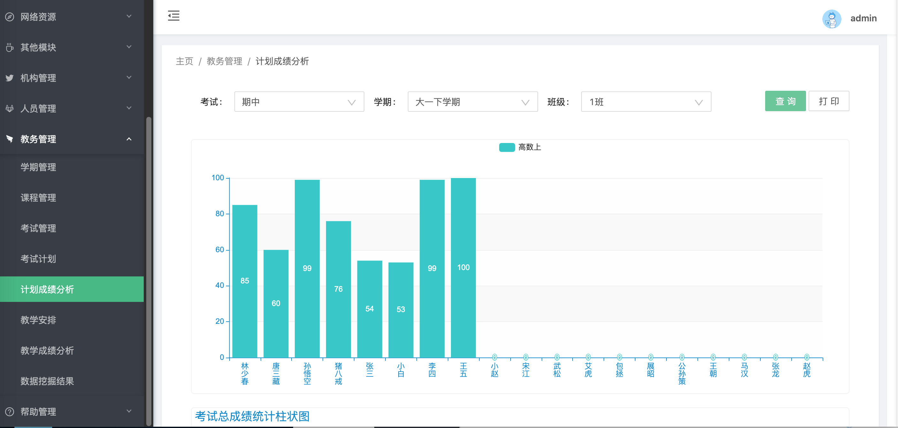

# Java学生成绩分析系统/学生成绩管理系统

基于 **SpringBoot** 和 **Vue** 进行构建

联系作者：QQ2522903074
### 项目简介

此项目旨在用于帮助教师以及学校管理员管理以及分析学生考试和学习的成绩，以可视化图表的方式进行全方面的展现

### 非系统功能

```
├─系统管理
│  ├─用户管理
│  ├─角色管理
│  ├─菜单管理
│  ├─部门管理
│  └─字典管理
├─系统监控
│  ├─在线用户
│  ├─系统日志
│  ├─Redis监控
│  ├─请求追踪
│  └─系统信息
│     ├─JVM信息
│     ├─服务器信息
│     └─Tomcat信息
│─任务调度
│  ├─定时任务
│  └─调度日志
│─网络资源
│  ├─天气查询
│  ├─影视资讯
│  │  ├─即将上映
│  │  └─正在热映
│  └─每日一文
└─其他模块
   └─导入导出

```

### 系统功能

####  1、管理员

- 机构管理
  - 学院管理
  - 年级管理
  - 班级管理
- 人员管理
  - 教师管理
  - 学生管理
- 教务管理
  - 学期管理
  - 课程管理
  - 考试管理
  - 考试计划
  - 计划成绩分析
  - 教学安排
  - 教学成绩分析
- 帮助管理
  - 留言管理

#### 2、教师

- 机构管理
  - 学院管理「仅查看」
  - 年级管理「仅查看」
  - 班级管理「仅查看，可查看此班级的成绩分析图表📈」
- 人员管理
  - 教师管理「可修改自己的基本信息，查看自己的教学安排成绩分析」
  - 学生管理「可修改自己班级中学生的基本信息，查看学生的成绩分析」
- 教务管理
  - 学期管理「仅查看」
  - 课程管理「仅查看」
  - 考试管理「仅查看」
  - 教学安排「查看教学安排信息以及成绩图表分析」
  - 教学成绩分析「筛选查看成绩分析」
- 帮助管理
  - 留言管理「仅查看」

#### 3、学生

- 机构管理
  - 学院管理「仅查看」
  - 年级管理「仅查看」
  - 班级管理「仅查看，可查看此班级的成绩分析图表📈」
- 人员管理
  - 学生管理「可查看自己的基本信息，查看自己的成绩分析」
- 教务管理
  - 学期管理「仅查看」
  - 课程管理「仅查看」
  - 考试管理「仅查看」
  - 教学安排「查看教学安排信息」
- 帮助管理
  - 留言管理「进行留言」

### 技术选型

#### 前端

- [Vue 2.6.10](https://cn.vuejs.org/),[Vuex](https://vuex.vuejs.org/zh/),[Vue Router](https://router.vuejs.org/zh/)
- [Axios](https://github.com/axios/axios)
- [vue-apexcharts](https://apexcharts.com/vue-chart-demos/line-charts/)
- [ant-design-vue](https://vuecomponent.github.io/ant-design-vue/docs/vue/introduce-cn/)
- [webpack](https://www.webpackjs.com/),[yarn](https://yarnpkg.com/zh-Hans/)

#### 后端

- [Spring Boot 2.1.7](http://spring.io/projects/spring-boot/)
- [Mybatis-Plus](https://mp.baomidou.com/guide/)
- [MySQL 5.7](https://dev.mysql.com/downloads/mysql/5.7.html#downloads),[Hikari](https://brettwooldridge.github.io/HikariCP/),[Redis](https://redis.io/)
- [Shiro](http://shiro.apache.org/),[JWT](https://jwt.io/)

### 项目截图

登录界面「下面使用管理员的身份进行登录」：

系统首页

个人中心

机构管理-学院管理

机构管理-年级管理

机构管理-班级管理

机构管理-班级管理-班级成绩图表分析

人员管理-教师管理


人员管理-教师管理-教师信息

人员管理-教师管理-教师教学成绩分析


人员管理-学生管ç†äººå‘˜ç®¡ç†-学生管理-学生信息

人员管理-学生管理-成绩查询

人员管理-学生管理-个人成绩图表分析


教务管理-学期管理


教务管理-课程管理


教务管理-考试管理


教务管理-考试计划


教务管理-计划成绩分析



教务管理-教学安排
教务管理-教学安排-成绩管理
教务管理-教学安排-教学安排 **单项** æˆç»©åˆ†æ教务管ç†-教学安排-教学安排 **所有** 成绩分析

帮助管理-留言管理


账号密码：

账号 | 密码| 权限
:-:|:-:|:-:
scott | 1234qwer | 注册账号，拥有查看，新增导出等权限，但不能新增用户
jack | 1234qwer |普通账户，仅拥有所有页面查看权限
mrbird | 1234qwer |超级管理员，拥有所有增删改查权限
bailu | 1234qwer |教师账号
LinShao | 1234qwer |学生账号

### 使用教程

#### 后端

1. IDEA 或者 Eclipse安装lombok插件
2. 安装并新建MySQL（版本5.7.x或以上）数据库，导入 **SQL** 文件
3. 安装并启动 Redis5
4. 修改数据库配置，redis配置，等待Maven下载依赖
5. 启动 backend 项目

#### 前端

1. 安装node.js「我的是16.19.1版本」

2. 切换到 frontend 文件夹下
```
# 安装yarn
npm install -g yarn

# 下载依赖
yarn install

# 启动
yarn start
```

